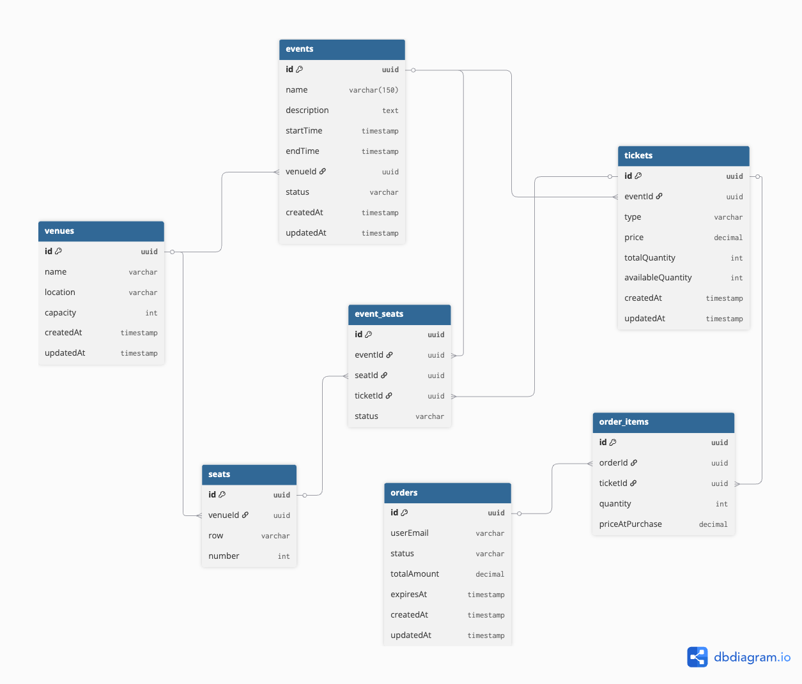

# BookMyEvent API

A seat-based ticketing backend system built with NestJS, TypeORM, and PostgreSQL. Designed for event organisers to create and manage events, with users able to purchase and reserve tickets.

---

## Table of Contents

- [Quick Start](#quick-start)
- [Project Structure](#project-structure)
- [Prerequisites](#prerequisites)
- [Setup Guide](#setup-guide)
- [Architecture Overview](#architecture-overview)
- [Database Schema](#database-schema)
- [API Routes Reference](#api-routes-reference)
- [End-to-End Scenarios](#end-to-end-scenarios)
- [Validation & Error Handling](#validation--error-handling)
- [Concurrency & Safety](#concurrency--safety)
- [Known Gaps](#known-gaps)

---

## Quick Start

```bash
# Install dependencies
pnpm install

# Start development server
pnpm dev
```

- **API:** http://localhost:3000
- **Swagger UI:** http://localhost:3000/api

---

## Project Structure

```
bookmyevent/
├── apps/
│   └── api/                        # NestJS API
│       └── src/
│           ├── app/                # Root module + bootstrap
│           ├── common/             # Shared utilities (pipes, filters, middleware)
│           ├── config/             # Database configuration
│           ├── entities/           # TypeORM entities
│           ├── migrations/         # Database migrations
│           ├── routes/             # Feature modules
│           │   ├── venues/          # Venue management
│           │   ├── events/          # Event management
│           │   ├── tickets/         # Ticket type management
│           │   └── orders/          # Order & reservation management
│           └── shared/             # Error classes
├── openapi.json                    # Swagger/OpenAPI specification
├── turbo.json                      # Turborepo configuration
└── pnpm-workspace.yaml            # pnpm workspaces
```

---

## Prerequisites

| Tool       | Version |
| ---------- | ------- |
| Node.js    | v20+    |
| pnpm       | v9+     |
| PostgreSQL | v14+    |

### Environment Variables

Create a `.env` file in `apps/api/`:

```env
DB_HOST=localhost
DB_PORT=5432
DB_USERNAME=postgres
DB_PASSWORD=postgres
DB_DATABASE=bookmyevent
```

---

## Setup Guide

### 1. Install Dependencies

```bash
pnpm install
```

### 2. Create Database

```sql
CREATE DATABASE bookmyevent;
```

### 3. Start the Server

```bash
pnpm dev
```

The API will:

- Connect to PostgreSQL
- Run pending migrations automatically
- Start listening on port 3000

### 4. Verify

```bash
# Health check
curl http://localhost:3000

# Swagger UI
open http://localhost:3000/api
```

---

## Architecture Overview

### Technology Stack

| Layer           | Technology                    |
| --------------- | ----------------------------- |
| Framework       | NestJS 11                     |
| ORM             | TypeORM                       |
| Database        | PostgreSQL                    |
| API Spec        | OpenAPI 3.0 (hand-maintained) |
| Validation      | Joi                           |
| Package Manager | pnpm                          |
| Monorepo        | Turborepo                     |

### Module Design

The application is organized into feature modules:

```
AppModule
├── VenuesModule    → Venue, Seat CRUD
├── EventsModule   → Event, EventSeat CRUD + seat allocation
├── TicketsModule  → Ticket CRUD
└── OrdersModule    → Order, OrderItem CRUD + reservation flow
```

### Request Flow

```
Client Request
    ↓
JoiValidationPipe (request validation)
    ↓
Controller (routing)
    ↓
Service (business logic)
    ↓
Repository (data access)
    ↓
Database
    ↓
Controller (response)
    ↓
AppErrorFilter (error handling)
    ↓
Client Response
```

---

## Database Schema

### Entity Relationships

[DB Diagram](https://dbdiagram.io/d/bookmyevent-69e27c550aa78f6bc1ff678f)


### Tables

#### venues

| Column     | Type      | Constraints   |
| ---------- | --------- | ------------- |
| id         | uuid      | PK            |
| name       | varchar   | NOT NULL      |
| location   | varchar   | NOT NULL      |
| capacity   | int       | NOT NULL      |
| created_at | timestamp | DEFAULT now() |
| updated_at | timestamp | DEFAULT now() |

#### seats

| Column   | Type    | Constraints                   |
| -------- | ------- | ----------------------------- |
| id       | uuid    | PK                            |
| venue_id | uuid    | FK → venues(id), CASCADE      |
| row      | varchar | NOT NULL (e.g., "A")          |
| number   | int     | NOT NULL                      |
|          |         | UNIQUE(venue_id, row, number) |

#### events

| Column      | Type         | Constraints               |
| ----------- | ------------ | ------------------------- |
| id          | uuid         | PK                        |
| name        | varchar(150) | NOT NULL                  |
| description | text         | NOT NULL                  |
| start_time  | timestamp    | NOT NULL                  |
| end_time    | timestamp    | NOT NULL                  |
| venue_id    | uuid         | FK → venues(id), RESTRICT |
| status      | varchar      | DEFAULT 'DRAFT'           |
| created_at  | timestamp    | DEFAULT now()             |
| updated_at  | timestamp    | DEFAULT now()             |

#### tickets

| Column     | Type          | Constraints                   |
| ---------- | ------------- | ----------------------------- |
| id         | uuid          | PK                            |
| event_id   | uuid          | FK → events(id), CASCADE      |
| type       | varchar       | NOT NULL (e.g., VIP, Regular) |
| price      | decimal(10,2) | NOT NULL                      |
| created_at | timestamp     | DEFAULT now()                 |
| updated_at | timestamp     | DEFAULT now()                 |
|            |               | UNIQUE(event_id, type)        |

#### event_seats

| Column     | Type      | Constraints                |
| ---------- | --------- | -------------------------- |
| id         | uuid      | PK                         |
| event_id   | uuid      | FK → events(id), CASCADE   |
| seat_id    | uuid      | FK → seats(id), CASCADE    |
| ticket_id  | uuid      | FK → tickets(id), SET NULL |
| status     | varchar   | DEFAULT 'AVAILABLE'        |
| expires_at | timestamp | NULLABLE                   |
| created_at | timestamp | DEFAULT now()              |
|            |           | UNIQUE(event_id, seat_id)  |
|            |           | INDEX(event_id, status)    |

#### orders

| Column       | Type          | Constraints               |
| ------------ | ------------- | ------------------------- |
| id           | uuid          | PK                        |
| user_email   | varchar       | NOT NULL                  |
| status       | varchar       | DEFAULT 'RESERVED'        |
| total_amount | decimal(10,2) | NOT NULL                  |
| expires_at   | timestamp     | NULLABLE (10 min TTL)     |
| created_at   | timestamp     | DEFAULT now()             |
| updated_at   | timestamp     | DEFAULT now()             |
|              |               | INDEX(status, expires_at) |

#### order_items

| Column            | Type          | Constraints              |
| ----------------- | ------------- | ------------------------ |
| id                | uuid          | PK                       |
| order_id          | uuid          | FK → orders(id), CASCADE |
| event_seat_id     | uuid          | FK → event_seats(id)     |
| price_at_purchase | decimal(10,2) | NOT NULL                 |

---

## API Routes Reference

### Venues — `/venues`

| Method | Path                      | Description                          |
| ------ | ------------------------- | ------------------------------------ |
| POST   | /venues                   | Create venue                         |
| GET    | /venues                   | List venues (paginated, searchable)  |
| GET    | /venues/:id               | Get venue                            |
| PATCH  | /venues/:id               | Update venue                         |
| DELETE | /venues/:id               | Delete venue (blocked if has events) |
| GET    | /venues/:id/seats         | List seats for venue                 |
| GET    | /venues/:id/events        | List events at venue                 |
| POST   | /venues/:id/seats         | Create single seat                   |
| POST   | /venues/:id/seats/bulk    | Bulk create seats                    |
| DELETE | /venues/:id/seats/:seatId | Delete single seat                   |
| DELETE | /venues/:id/seats/bulk    | Bulk delete seats                    |

### Events — `/events`

| Method | Path                                     | Description                                |
| ------ | ---------------------------------------- | ------------------------------------------ |
| POST   | /events                                  | Create event                               |
| GET    | /events                                  | List events                                |
| GET    | /events/:id                              | Get event                                  |
| PATCH  | /events/:id                              | Update event                               |
| DELETE | /events/:id                              | Delete event (blocked if has BOOKED seats) |
| GET    | /events/:id/seats                        | List event seats with details              |
| GET    | /events/:id/seats/status                 | Seat availability summary                  |
| POST   | /events/:id/seat-allocation              | Allocate seats to ticket                   |
| GET    | /events/:id/seat-allocation              | List allocations                           |
| DELETE | /events/:id/seat-allocation/:eventSeatId | Remove allocation                          |
| POST   | /events/:id/seat-allocation/release      | Release expired seats                      |

### Tickets — `/events/:eventId/tickets`

| Method | Path                               | Description                                |
| ------ | ---------------------------------- | ------------------------------------------ |
| POST   | /events/:eventId/tickets           | Create ticket type                         |
| GET    | /events/:eventId/tickets           | List ticket types                          |
| GET    | /events/:eventId/tickets/:ticketId | Get ticket                                 |
| PATCH  | /events/:eventId/tickets/:ticketId | Update ticket                              |
| DELETE | /events/:eventId/tickets/:ticketId | Delete ticket (blocked if seats allocated) |

### Orders — `/orders`

| Method | Path                | Description                         |
| ------ | ------------------- | ----------------------------------- |
| POST   | /orders             | Create order (reserve seats)        |
| GET    | /orders             | List orders                         |
| GET    | /orders/:id         | Get order with items                |
| POST   | /orders/:id/confirm | Confirm order                       |
| POST   | /orders/:id/cancel  | Cancel order                        |
| PATCH  | /orders/:id         | Update order status                 |
| DELETE | /orders/:id         | Delete order (blocked if CONFIRMED) |

---

## End-to-End Scenarios

### Scenario 1: Create an Event with Seats

**Goal:** Set up a venue with seats and create an event.

#### Step 1: Create Venue

```bash
curl -X POST http://localhost:3000/venues \
  -H "Content-Type: application/json" \
  -d '{
    "name": "Grand Theater",
    "location": "123 Main Street, City",
    "capacity": 1000
  }'
```

Response:

```json
{
  "success": true,
  "data": { "id": "<venue-id>", "name": "Grand Theater", ... },
  "message": "Venue created successfully"
}
```

#### Step 2: Bulk Create Seats

Create seats for rows A-E, seats 1-20:

```bash
curl -X POST "http://localhost:3000/venues/<venue-id>/seats/bulk" \
  -H "Content-Type: application/json" \
  -d '{
    "seats": [
      { "row": "A", "startNumber": 1, "endNumber": 20 },
      { "row": "B", "startNumber": 1, "endNumber": 20 },
      { "row": "C", "startNumber": 1, "endNumber": 20 },
      { "row": "D", "startNumber": 1, "endNumber": 20 },
      { "row": "E", "startNumber": 1, "endNumber": 20 }
    ]
  }'
```

#### Step 3: Create Event

```bash
curl -X POST http://localhost:3000/events \
  -H "Content-Type: application/json" \
  -d '{
    "name": "Summer Concert 2026",
    "description": "Annual summer music festival",
    "startTime": "2026-07-15T19:00:00Z",
    "endTime": "2026-07-15T23:00:00Z",
    "venueId": "<venue-id>"
  }'
```

#### Step 4: Create Ticket Types

```bash
# VIP Ticket
curl -X POST "http://localhost:3000/events/<event-id>/tickets" \
  -H "Content-Type: application/json" \
  -d '{"type": "VIP", "price": 200}'

# Regular Ticket
curl -X POST "http://localhost:3000/events/<event-id>/tickets" \
  -H "Content-Type: application/json" \
  -d '{"type": "Regular", "price": 100}'
```

#### Step 5: Allocate Seats to Tickets

First, get available seat IDs:

```bash
curl "http://localhost:3000/venues/<venue-id>/seats"
```

Allocate seats to VIP ticket:

```bash
curl -X POST "http://localhost:3000/events/<event-id>/seat-allocation" \
  -H "Content-Type: application/json" \
  -d '{
    "seatIds": ["<seat-id-1>", "<seat-id-2>", ...],
    "ticketId": "<vip-ticket-id>"
  }'
```

Check seat availability:

```bash
curl "http://localhost:3000/events/<event-id>/seats/status"
```

---

### Scenario 2: Reserve and Purchase Tickets

**Goal:** A user reserves seats and confirms the booking.

#### Step 1: Reserve Seats

```bash
curl -X POST http://localhost:3000/orders \
  -H "Content-Type: application/json" \
  -d '{
    "userEmail": "john@example.com",
    "eventId": "<event-id>",
    "seatIds": ["<event-seat-id-1>", "<event-seat-id-2>"]
  }'
```

Response:

```json
{
  "success": true,
  "data": {
    "id": "<order-id>",
    "userEmail": "john@example.com",
    "status": "RESERVED",
    "totalAmount": "400.00",
    "expiresAt": "2026-04-19T12:10:00.000Z",
    ...
  },
  "message": "Order reserved successfully"
}
```

Seats are now RESERVED with a 10-minute expiration.

#### Step 2: Confirm Order

```bash
curl -X POST "http://localhost:3000/orders/<order-id>/confirm"
```

Response:

```json
{
  "success": true,
  "data": { "status": "CONFIRMED" },
  "message": "Order confirmed successfully"
}
```

Seats are now BOOKED.

---

### Scenario 3: Cancel Reservation

**Goal:** User changes mind and cancels the order.

```bash
curl -X POST "http://localhost:3000/orders/<order-id>/cancel"
```

Response:

```json
{
  "success": true,
  "data": { "status": "CANCELLED" },
  "message": "Order cancelled successfully"
}
```

Seats return to AVAILABLE status.

---

### Scenario 4: Check Event Status

**Goal:** Check available seats for an event.

```bash
curl "http://localhost:3000/events/<event-id>/seats/status"
```

Response:

```json
{
  "success": true,
  "data": {
    "total": 100,
    "available": 80,
    "reserved": 15,
    "booked": 5
  }
}
```

---

### Scenario 5: Release Expired Reservations

**Goal:** Manually release seats where reservations have expired. I have planned to implement background cron worker to clean up the expired reservations. Due to time constraints, I implemented an API to manually release expired reservations.

```bash
curl -X POST "http://localhost:3000/events/<event-id>/seat-allocation/release"
```

---

## Validation & Error Handling

### Request Validation

All POST and PATCH endpoints validate request bodies using Joi schemas. Invalid requests return:

```json
{
  "success": false,
  "error": {
    "code": "BAD_REQUEST",
    "message": "Validation failed",
    "details": [...]
  }
}
```

### Business Validation

Business rules are enforced in service layer:

| Operation     | Rule                         | Error                  |
| ------------- | ---------------------------- | ---------------------- |
| Delete venue  | Must have no events          | 400 BadRequestError    |
| Delete event  | Must have no BOOKED seats    | 400 BadRequestError    |
| Delete ticket | Must have no allocated seats | 400 BadRequestError    |
| Allocate seat | Seat must be AVAILABLE       | 409 ConflictError      |
| Allocate seat | Ticket must belong to event  | 422 UnprocessableError |
| Order create  | Seats must be AVAILABLE      | 409 ConflictError      |
| Order confirm | Order must be RESERVED       | 400 BadRequestError    |
| Order cancel  | Order must not be CONFIRMED  | 400 BadRequestError    |

### HTTP Status Codes

| Code | Usage                                    |
| ---- | ---------------------------------------- |
| 200  | Success (GET, PATCH)                     |
| 201  | Created (POST)                           |
| 204  | No Content (DELETE)                      |
| 400  | Bad Request (validation, business rules) |
| 404  | Not Found                                |
| 409  | Conflict (duplicate, unavailable)        |
| 422  | Unprocessable (ownership mismatch)       |
| 500  | Internal Server Error                    |

---

## Concurrency & Safety

### Transaction Management

All booking operations use database transactions:

```typescript
const queryRunner = dataSource.createQueryRunner();
await queryRunner.connect();
await queryRunner.startTransaction();

try {
  // Lock seat rows
  const seat = await queryRunner.manager.findOne(EventSeat, {
    where: { id: seatId },
    lock: { mode: 'pessimistic_write' },
  });
  // Update status
  await queryRunner.manager.update(EventSeat, seatId, { status: 'BOOKED' });
  await queryRunner.commitTransaction();
} catch (error) {
  await queryRunner.rollbackTransaction();
} finally {
  await queryRunner.release();
}
```

### Race Condition Prevention

- `SELECT ... FOR UPDATE` locks seat rows before status changes
- UNIQUE constraint on `(event_id, seat_id)` at DB level
- Duplicate seat ID check in service layer before DB hit

---

## Known Gaps

1. **Automated Expiry Job**
   - Currently, seat expiry is triggered manually via `POST /events/:id/seat-allocation/release`
   - A background scheduler (cron) should poll for expired reservations

2. **Authentication**
   - No auth layer implemented
   - All endpoints are publicly accessible
   - No roles and permissions

3. **Payment Integration**
   - No payment gateway integration
   - Order total is calculated but not charged
